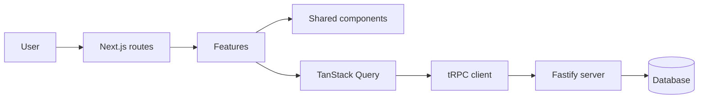
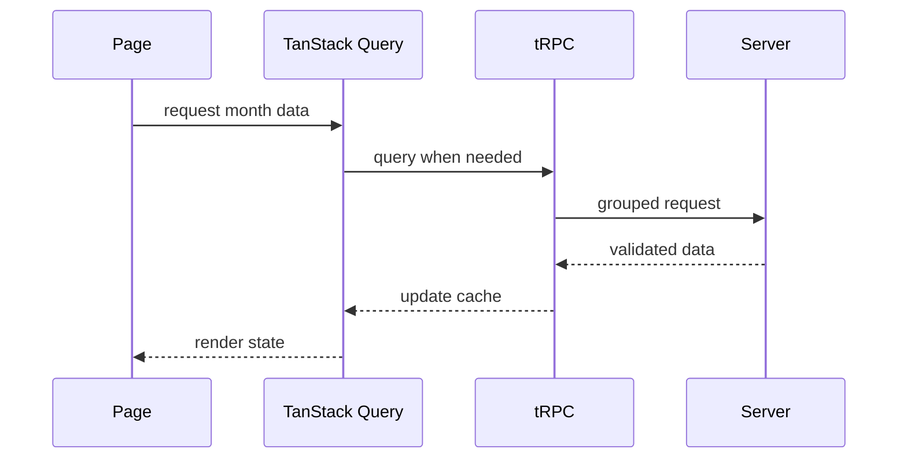

# Frontend Architecture

## Purpose

The GFinanças frontend supports monthly financial planning. It helps people distribute money across phases, income, expenses, cards, goals, and reserves without recording everyday transactions.

The current prototype keeps data in memory. The production implementation must preserve its user experience while replacing local financial state with server calls through tRPC.

## Principles

- The frontend never accesses the database directly.
- Every persistent read and write goes through the server.
- Each domain owns its presentation components and UI rules.
- Remote state lives in TanStack Query.
- Temporary UI state stays close to the component that uses it.
- Reusable visual components live in the shared UI package.
- Types returned by the server are inferred from the tRPC router.
- Light and dark themes share semantic color variables.
- The interface is designed for small screens first and expands for desktop.

## Overview



Dependencies flow from routes to features. Features may use shared components and the tRPC client. Shared components do not know financial rules or depend on features.

## Technology

| Responsibility  | Choice                              |
| --------------- | ----------------------------------- |
| Web application | Next.js with App Router             |
| UI              | React and strict TypeScript         |
| Styling         | Tailwind CSS and semantic variables |
| Base components | Shared UI package                   |
| Icons           | Lucide React                        |
| Remote state    | TanStack Query                      |
| Communication   | tRPC                                |
| Validation      | Zod shared with the API             |
| Theme           | next-themes                         |
| Notifications   | Sonner                              |

## Recommended organization

```text
apps/web/src/
├── app/
│   ├── layout.tsx
│   ├── page.tsx
│   ├── planning/page.tsx
│   ├── cards/page.tsx
│   ├── goals/page.tsx
│   └── reserves/page.tsx
├── features/
│   ├── overview/
│   ├── planning/
│   │   ├── components/
│   │   ├── hooks/
│   │   ├── schemas/
│   │   └── utils/
│   ├── cards/
│   ├── goals/
│   └── reserves/
├── components/
│   └── app-shell/
├── hooks/
├── lib/
│   ├── money.ts
│   ├── dates.ts
│   └── query-client.ts
└── utils/
    └── trpc.ts

packages/ui/src/
├── components/
└── styles/
```

Routes should only load data, compose pages, and define metadata. Domain rules belong to their feature. Currency and date formatting belong in shared utilities.

## Features

### Overview

Shows the month summary, available amount, expense distribution, goal progress, and shortcuts. It consumes server-calculated values or selectors derived from the cache.

### Planning

Controls the selected month and its phases. Each phase has a name, start day, end day, income, and expenses.

Income categories are Salary, Reserve, and Other. Reserve selection is visible but disabled until the reserve delivery enables balance movements.

Expense categories are Fixed expenses, Variable fixed expenses, Variable expenses, Reserve, and Investments. A selected reserve balance is not changed until the reserve integration delivery.

### Cards

Manages cards and planned purchases. A card has a name, limit, due date, final digits, and appearance. A purchase includes an amount, card, and number of installments.

### Financial goals

Represents medium- and long-term targets, such as building an emergency fund or investing a set amount. It shows target value, accumulated value, deadline, and progress.

### Reserves

Represents money set aside for known future expenses. It shows purpose, required amount, current balance, and planned use date.

## State

| Type          | Examples                            | Location             |
| ------------- | ----------------------------------- | -------------------- |
| Remote        | plans, cards, goals, and reserves   | TanStack Query cache |
| Route         | selected page, month, and year      | URL                  |
| UI            | open modal, active tab, and sidebar | local state          |
| Form          | fields and amount previews          | form component       |
| Global visual | light or dark theme                 | theme provider       |

Financial data must not be duplicated in React contexts. Query cache is the source of truth after server integration.

## Read flow



Every page must provide loading, empty, and error states. Changing months changes the query key, allowing an independent cache for each period.

## Mutation flow

1. The form validates its fields.
2. The feature sends a tRPC mutation.
3. The server applies the financial rule.
4. The response updates or invalidates affected queries.
5. The UI closes the modal and shows confirmation.
6. If it fails, entered values remain available.

Balance movements for goals and reserves must be atomic on the server. The frontend only presents a projected balance. Monthly planning records do not change those balances until the reserve integration delivery.

## Components

The application shell contains the sidebar, top bar, month selector, and main content area. Each page receives the shell through a shared layout.

Domain components include the planning summary, phase tabs, categorized lists, financial card, purchase table, goal, and reserve.

Buttons, fields, selects, dialogs, progress bars, empty states, and notifications must come from the shared package. These components accept visual properties and do not know financial rules.

## Forms

Every form has a Zod schema close to its feature. Messages appear beside their related field. Monetary values are converted to integer cents before submission to avoid floating-point calculations.

The submit button is disabled while its mutation is pending. Closing a modal must not modify already persisted data.

## Theme and styling

Colors use semantic names such as surface, text, border, success, warning, and accent. Domain components must not depend directly on a particular color.

The existing provider applies theme at the root element. Contrast, visible focus, and interaction states must work in both themes.

## Responsiveness and accessibility

The sidebar becomes an overlay menu on small screens. Headers and action groups wrap across lines. Phase tabs may scroll horizontally when space is limited.

Dialogs must manage focus, close with Escape, and expose a title. Fields need labels, associated errors, and predictable keyboard order. Values and colors must never be the only way to convey state.

## Evolution strategy

1. Extract the shell and domain components from the current page.
2. Create one route per feature.
3. Move formatting, dates, and presentation calculations to utilities.
4. Implement tRPC queries and mutations by domain.
5. Replace in-memory state gradually with remote cache.
6. Consolidate generic components in the shared package.
7. Add integration tests as the prototype becomes a persistent implementation.

During migration, every feature must remain usable. The current page can serve as a visual reference until all routes own their flows.
